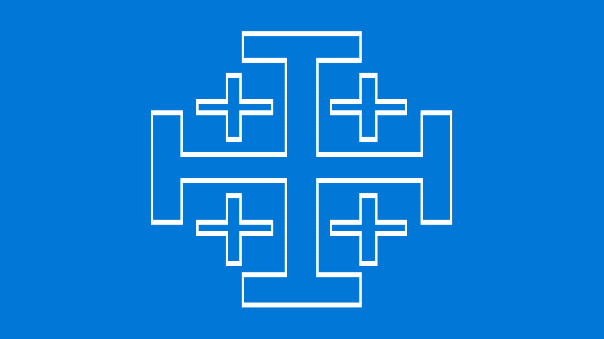

# blue-screen-of-death

An Omarchy extra theme inspired by the Windows Blue Screen of Death, but rewritten as a thank-you note for finally pushing us to Linux.

This repository follows Omarchy's extra-theme layout:

- Theme files live at the repository root.
- Wallpapers live in `backgrounds/`.
- The repo name uses the `omarchy-<theme>-theme` pattern so `omarchy-theme-install` resolves the theme name correctly.

## Install

```bash
omarchy-theme-install https://github.com/ryangerardwilson/omarchy-blue-screen-of-death-theme.git
```

If you clone it manually:

```bash
git clone https://github.com/ryangerardwilson/omarchy-blue-screen-of-death-theme.git ~/.config/omarchy/themes/blue-screen-of-death
omarchy-theme-set blue-screen-of-death
```

## Included Overrides

- `colors.toml` for Omarchy-generated theme files
- `btop.theme` for a readable blue/white system monitor palette
- `alacritty.toml` to keep terminal text white on the BSOD blue background
- `hyprland.conf` for white active borders and light-gray inactive borders
- `tmux.conf` for white-background, blue-text tmux UI elements
- `neovim.lua`, `vscode.json`, and `icons.theme` for app-specific alignment
- `wallpaper.svg`, `preview.png`, and `backgrounds/0-blue-screen-of-death.png`

## tmux

Omarchy does not currently wire theme files into tmux automatically. To use the included `tmux.conf`, add this line to your main `~/.config/tmux/tmux.conf`:

```tmux
if-shell '[ -f ~/.config/omarchy/current/theme/tmux.conf ]' 'source-file ~/.config/omarchy/current/theme/tmux.conf'
```

## Preview


